

  

  <a href="https://github.com/Anonymous-520">GitHub</a>
  &nbsp;|&nbsp;
  <a href="https://sillionona.com">Sillionona</a>
  &nbsp;|&nbsp;
  <a href="mailto:sakshamhacker520@outlook.com">Email</a>
  &nbsp;|&nbsp;
  <a href="#research-core">Research Core</a>
  &nbsp;|&nbsp;
  <a href="#project-galaxy">Project Galaxy</a>

 

  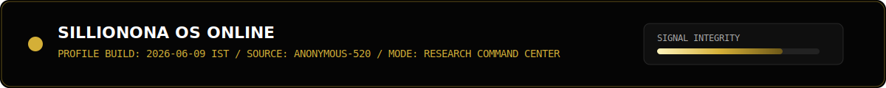

<!--
SILLIONONA OS hidden channel:
up up down down left right left right b a
No scripts. No fake achievements. Only factual identity, public account data, and generated visuals.
-->

## Mission Control

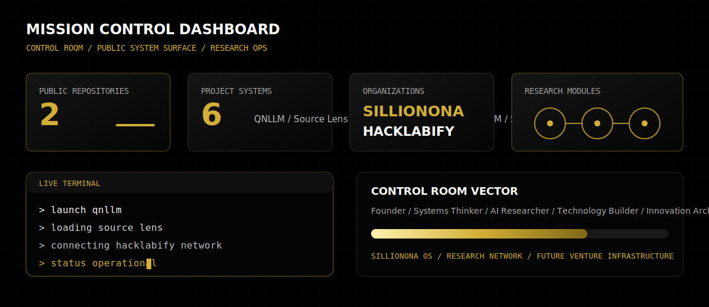

Saksham Rastogi is building Sillionona as a long-term technology ecosystem across artificial intelligence, research systems, finance infrastructure, intelligent agents, automation, and knowledge platforms.

| Identity | Signal |
|---|---|
| Name | Saksham Rastogi |
| GitHub | [Anonymous-520](https://github.com/Anonymous-520) |
| Role | Founder, Researcher, Builder |
| Organizations | Sillionona, HackLabify |
| Location | New Delhi, India |
| Operating focus | AI, research, finance, innovation, technology |

## Global Node

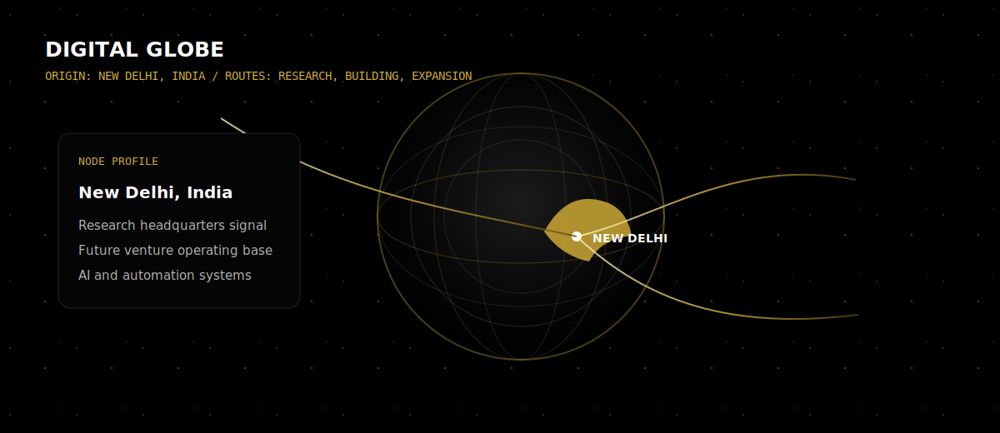

## Neural Network Core


## Project Galaxy

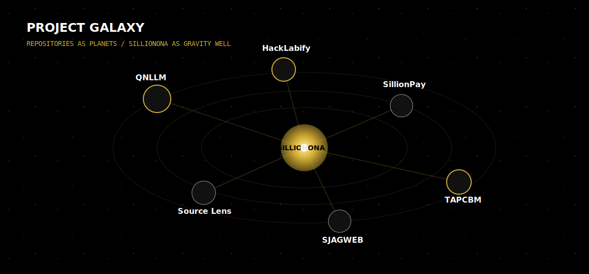

| Project | System Role | Public Surface |
|---|---|---|
| QNLLM | Interpretable learning-system research | [QNLLM public repository](https://github.com/Anonymous-520/Quantum-Neurological-Large-Language-Model-QNLLM-Public) |
| Source Lens | Code and knowledge inspection systems | Listed initiative |
| HackLabify | Builder network and technology lab | Listed organization |
| SillionPay | Finance systems exploration | Listed initiative |
| TAPCBM | Structured systems project | Listed initiative |
| SJAGWEB | Web systems project | Listed initiative |

## Research Core

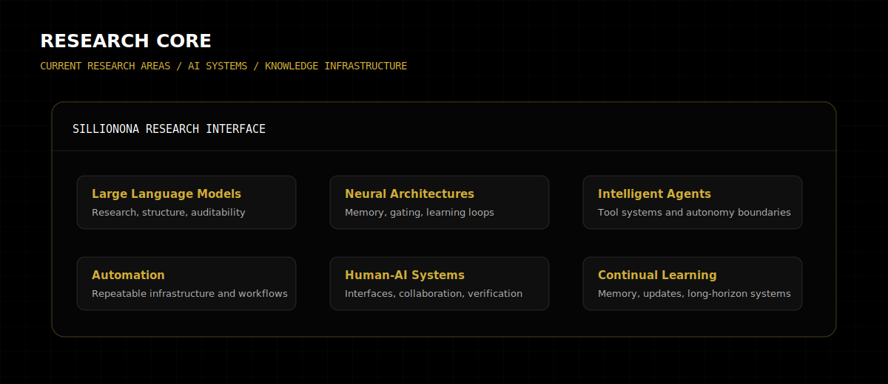

## Technology Matrix

| Languages | Systems | Research Domains |
|---|---|---|
| Python | Linux | Artificial intelligence |
| TypeScript | Docker | Large language models |
| JavaScript | Git | Neural architectures |
| HTML | Node.js | Intelligent agents |
| CSS | Automation | Human-AI systems |
| C++ | Research tooling | Continual learning |
| Kotlin | Knowledge infrastructure | Finance systems |

## Ecosystem Map

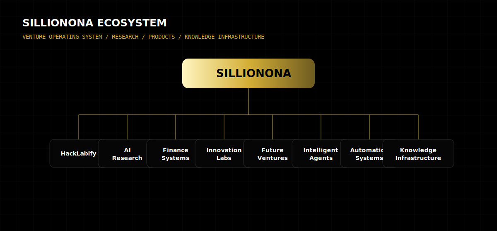

## Innovation Radar


## Timeline

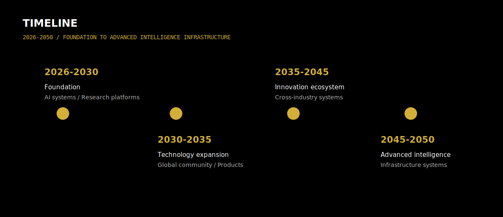

## GitHub Analytics

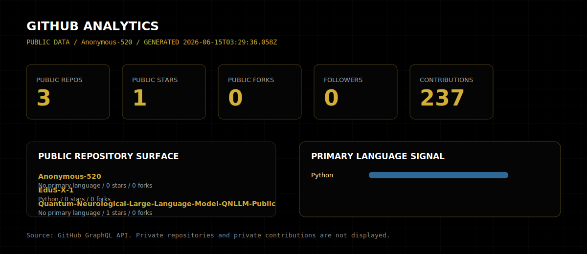

The analytics workflow in `.github/workflows/metrics.yml` refreshes this panel from GitHub's API. The seeded data uses only public account and repository information.

## Contribution Snake

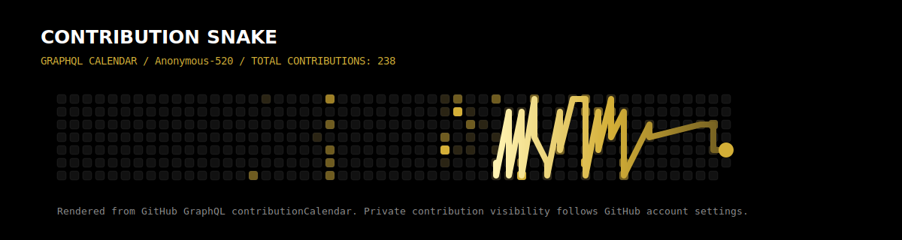

The snake workflow replaces this local asset with a GraphQL contribution-calendar render after the first manual or scheduled run.

## Founder Profile

| Dimension | Focus |
|---|---|
| Founder | Sillionona ecosystem direction |
| Builder | Research tools, automation systems, product infrastructure |
| Researcher | AI, neural architectures, learning systems, knowledge networks |
| Technology architect | Long-term intelligent systems and future venture infrastructure |

## Operating Principles

| Principle | Meaning |
|---|---|
| Factual surface | No fake awards, fake statistics, or exaggerated claims |
| Research first | Systems are designed around learning, validation, and auditability |
| Long horizon | 2026-2050 roadmap thinking, not short-term profile decoration |
| Builder energy | Projects, code, infrastructure, and tools remain the center of gravity |

  

